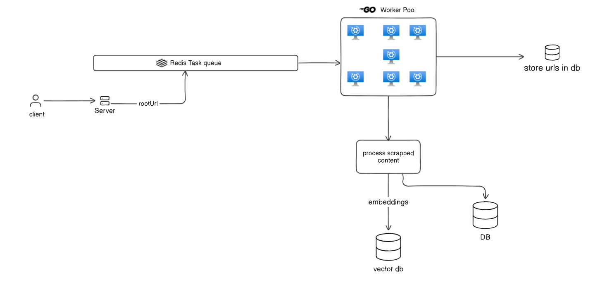

# Fluxi : An Efficient and Scalable Framework for Web Scraping needs

## Getting Started



### Tech Stack

- Golang
- Redis
- PostgreSQL

### Installation

- Clone the repository
- Install Redis
- Install PostgreSQL
- Make sure connection string of PostgreSQL and redis is correctly set in the .env file

- Run the following command to install the dependencies

```bash
go mod tidy
```

- Run the following command to start the server

```bash
go run main.go
```

- Scrapper Server will be running on port 8080
